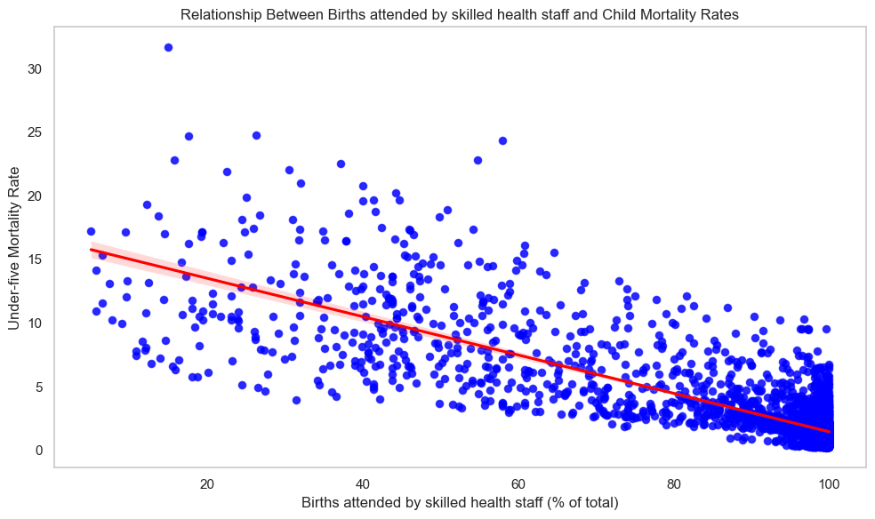
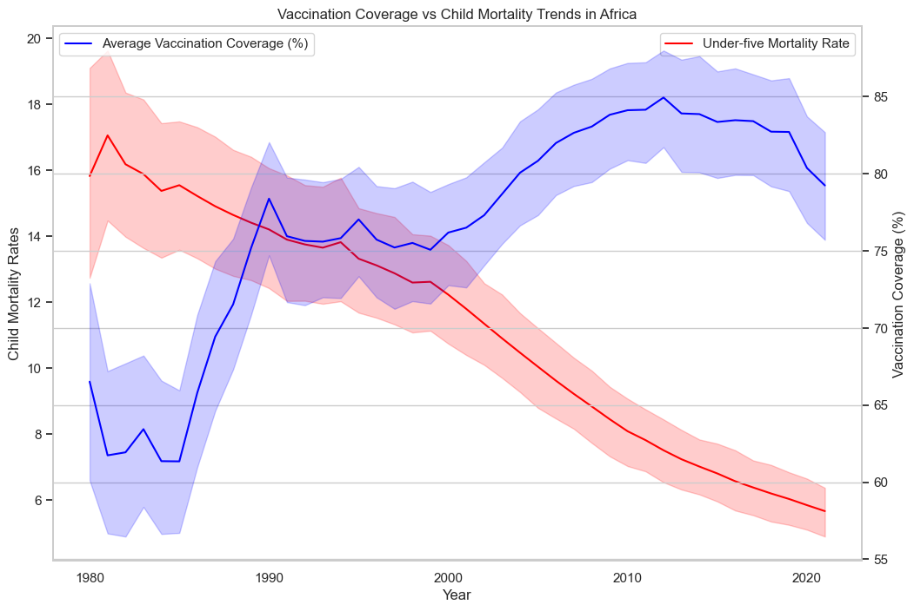
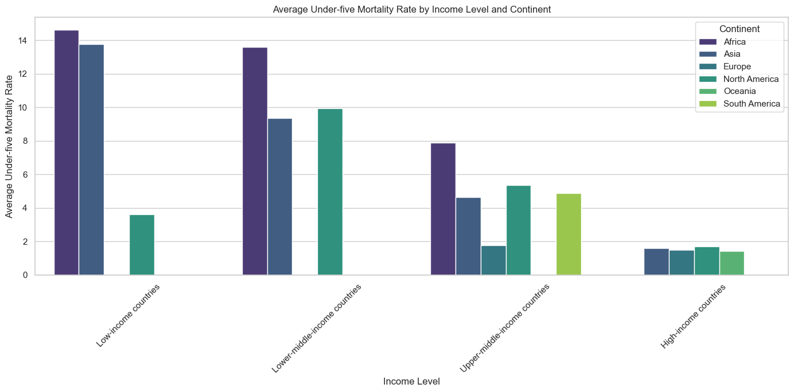
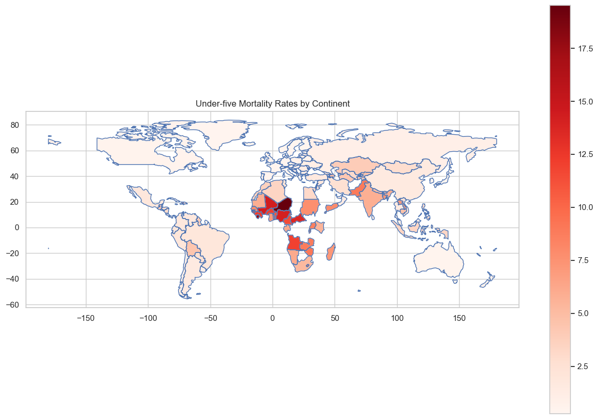

# **Tackling Child and Infant Mortality in Africa**

## **Project Overview**
This project aims to address one of Africa's most pressing public health issues: **high infant and child mortality rates**. Through the use of **data analysis** and **predictive modeling**, this project identifies the key factors contributing to child mortality across African countries, including **socioeconomic variables**, **healthcare access**, and **immunization coverage**. By leveraging a variety of datasets, we uncover actionable insights that can drive targeted interventions to improve child health outcomes and achieve **Sustainable Development Goal (SDG) 3: Good Health and Well-being**.

## **Problem Statement**
Despite significant global progress, **Africa continues to experience disproportionately high rates of child and infant mortality**, especially in sub-Saharan regions. This problem is exacerbated by:
- **Poor healthcare access**
- **Inadequate vaccination coverage**
- **Socioeconomic disparities** (e.g., maternal education, household income)

This project aims to:
- Identify the **major determinants** of infant and child mortality in Africa.
- Explore the **geographical disparities** in mortality rates across the continent.
- Provide **data-driven recommendations** to guide policymakers and organizations in reducing preventable deaths.

## **Objectives**
The primary objectives of this project are to:
1. **Analyze Mortality Trends**: Investigate trends in infant and child mortality rates across African countries and identify patterns of growth or decline.
2. **Examine Socioeconomic and Healthcare Factors**: Understand the correlation between factors like **vaccination coverage**, **access to skilled healthcare staff**, **health protection coverage**, and **socioeconomic status** with mortality rates.
3. **Develop Predictive Models**: Build predictive models to identify **high-risk regions** or countries that require targeted interventions.
4. **Provide Actionable Recommendations**: Suggest strategies for improving **healthcare infrastructure**, **maternal health**, and **vaccination coverage** in regions with high mortality rates.

## **Data Sources**
This analysis uses several datasets from credible sources to build a comprehensive understanding of the factors influencing mortality rates:
- **Youth Mortality Rates**: Data on deaths per 1,000 live births for children under 15 years.
- **Number of Infant Deaths**: Data on the total number of infant deaths (age 0) for each year by country.
- **Child Mortality by Income Level**: Data on the number of deaths of children under five years per 100 live births across different income levels.
- **Maternal Deaths by Region**: Data on the estimated number of maternal deaths per year by country.
- **Global Vaccination Coverage**: Immunization coverage data for various diseases.
- **Births Attended by Skilled Staff**: Percentage of births attended by skilled healthcare staff.
- **Health Protection Coverage**: Data on the percentage of the population covered by health insurance.
- **Causes of Death in Children Under Five**: Major contributors to child mortality.

## **Tools and Libraries**
The following tools and Python libraries were utilized for the analysis:
- **Libraries**: `pandas`, `numpy`, `matplotlib`, `seaborn`, `geopandas`
- **Visualization**: Geospatial analysis and data visualization techniques (e.g., choropleth maps, trend visualization)
- **Predictive Models**: Feature importance analysis to identify key mortality drivers using **Random Forest** models.

## **Project Workflow**

### **1. Data Collection and Cleaning**
The first phase involved **gathering multiple datasets** from sources like global health organizations. After that:
- **Data cleaning** was performed by inspecting and handling missing values, duplicates, and inconsistent data.
- **Null values** were imputed or removed, and **data normalization** was applied to ensure consistency across datasets.

### **2. Exploratory Data Analysis (EDA)**
During EDA:
- **Trends in Mortality Rates**: Mortality trends across African regions and income levels were visualized using **line charts** and **bar charts**.
- **Correlation Analysis**: The relationships between **healthcare access**, **vaccination rates**, and **mortality rates** were analyzed. **Scatter plots** and **correlation heatmaps** were used.
- **Geographical and Socioeconomic Disparities**: Visualizations like **choropleth maps** were used to show geographical disparities, particularly in **sub-Saharan Africa**.

### **3. Predictive Modeling**
- **Random Forest Classifier**: A **Random Forest model** was built to predict high-risk regions for mortality based on various health and socioeconomic features.
- **Feature Importance**: The model revealed that **maternal health** and **vaccination coverage** were the most significant predictors of child survival.

### **4. Results and Insights**
- **Key Findings**:
  1. **Healthcare Access**: Countries with poor access to skilled healthcare staff and maternal health services have higher mortality rates.
  

  3. **Vaccination Coverage**: Higher vaccination rates correlate with lower mortality rates.
  
  
  5. **Socioeconomic Disparities**: Low-income regions exhibit significantly higher mortality rates.
   
     
  7. **Geographical Disparities**: Sub-Saharan Africa is identified as the region with the highest mortality rates.
  
  
## **Key Recommendations**
1. **Strengthen Primary Healthcare**:
   - Improve healthcare infrastructure and train more healthcare professionals in high-risk areas.
2. **Increase Vaccination Coverage**:
   - Launch targeted vaccination campaigns, especially in remote and underserved areas.
3. **Promote Maternal Education**:
   - Educate mothers about prenatal care, child nutrition, and the importance of vaccinations.
4. **Address Socioeconomic Inequalities**:
   - Increase investments in economic development to reduce poverty and improve access to healthcare.
5. **Implement Data-Driven Policies**:
   - Use real-time data to target high-risk regions and allocate resources effectively.

## **Future Work**
- **AI & Machine Learning**: Further enhance predictive models using machine learning techniques.
- **Cross-Sector Collaboration**: Engage with sectors beyond healthcare, such as education and sanitation, to address root causes.
- **Policy Impact Evaluation**: Evaluate the long-term impact of interventions.

## **Conclusion**
This project has demonstrated the power of **data science** in addressing one of Africa's most urgent public health challenges. By identifying key determinants of mortality and providing actionable recommendations, it lays the groundwork for targeted interventions aimed at reducing preventable child and infant deaths. However, continued **collaboration**, **investment**, and **policy action** are required to achieve sustainable improvements in child health outcomes across Africa.

## **Contact**

For further inquiries or collaborations, feel free to reach out:

- **Name**: Gogo Isaac Harrison
- **Email**: gogoharrison66@gmail.com
- **LinkedIn**: [LinkedIn Profile](https://www.linkedin.com/in/gogo-harrison/)

## **License**

This project is licensed under the MIT License - See the [LICENSE](LICENSE) file for details.
